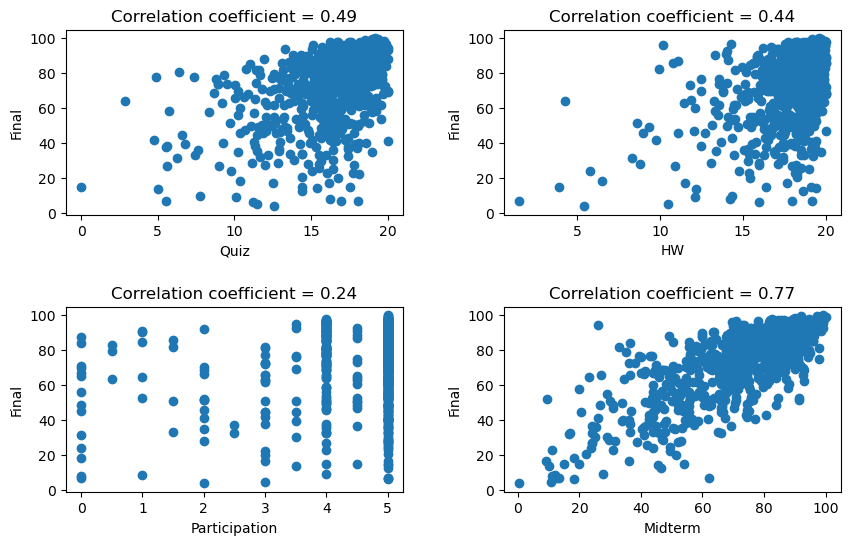
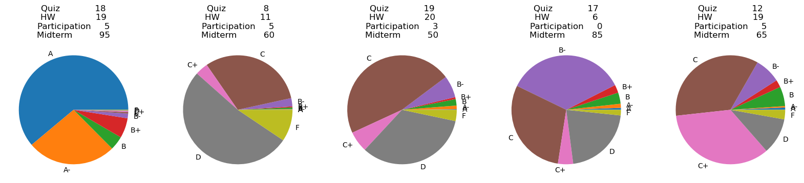

# grade-prediction
An analysis and prediction models for grades based on real data from NYU classes.

# Introduction

The data for this project are grades for the classes Math for Economics I, II, and III, from 2022 to 2023. The grades are the following.

- Participation, out of 5. This is evaluated by the TA.
- Quizzes (average of all quiz grades), out of 20. These are done at home with limited time and no help allowed.
- Homework (HW, average of all HW grades), out of 20. These are done at home with unlimited time and any resources are allowed.
- Midterm (1 or 2 per term), out of 100. These are done in class with limited time and no resources allowed.
- Final exam. This is done during the final exam week with limited time and no resources allowed.

Their final grade is calculated as a weighted average of all the above grade, with a slightly different scheme each time. Then, this final grade is turned into a letter grade (A, A-, B+, B, B-, C+, C, , F) according to thresholds that are slightly different each term.

The goal of this project is to use only the data of participation, quiz, homework, and midterm grades to predict the final grade. The idea is that a student should know or be able to estimate these grades very well halfway through the semester. There are two aspects to this that we explore.

- Use these grades to predict the final exam point grade. This is a **regression** problem.
- Use the grades to predict the letter grade. This is a **classification** problem.

# Data

Data is available in `data/final/all_grades_no_outliers.csv`, cleaned using the `scripts/data_cleaning.py` script.
- All grades for all classes are first joined together. Some students took several classes, so in order to conserve independence, only the grades for one class for each student is conserved.
- Grades that are missing are converted to a 0, as is the class's policy.
- There are some outliers, namely student who did not take a midterm or the final exam. These are removed.

In the end, the data used consists of 805 rows, with features `Quiz`, `HW`, `Participation`, `Midterm`. For the regression question, the feature used is the numerical value `Final`. For the classification question, the feature used is the categorical value `Letter grade`.

# Data exploration

Details can be found in the `data-exploration.ipynb` notebook. Let us first look at the scatterplots.

As expected, we see a clear trend upwards. Participation, however, seems to be the exception. As one would also anticipate, the midterm grades are much more correlated with final exam grades than the quiz or homework grades. It is also worth noting that homework grades are all very high, since these are done at home with virtually unlimited time and graded by undergraduate graders.

Regarding the classification problem, we have the following distribution of grades.

| A   | A\- | B   | B\+ | B\- | C   | C\+ | D   | F   |
|:---:|:---:|:---:|:---:|:---:|:---:|:---:|:---:|:---:|
| 110 | 98  | 115 | 83  | 62  | 110 | 80  | 101 | 107 |

It is slightly imbalanced, but not enough that any special care should be taken.

# Final exam grade prediction

As a first task, we study how the data of `Quiz`, `HW`, `Participation`, and `Midterm` grades can predict the `Final` exam grade.

## Choice of model

To this end, we fit several models to the data with grid search and compare using cross-validation. The models used are linear regression (with and without regularization), KNN, random forest ensemble, and gradient boosted tree. We also use standard scaling, and add polynomial features up to degree 3. Details can be found in the `regression_CV.ipynb` notebook. 

In the end, the **gradient-boosted tree** with polynomial features performs the best, with a $r^2$ score of $0.582$. Linear regression is slightly behind with a score of $0.579$; regularization and polynomial features barely make a difference.

The optimal GB tree and linear regression models are trained with the `scripts/regression.py` scripts using the whole training set, and then pickled in the `results/regression` folder. No polynomial features are used since they barely improve the score and in order to make interpretation easier. For these models, we find the following scores:
- Linear regression: score on training set = $0.588$, score on test set = $0.640$.
- GB tree: score on training set = $0.639$, score on test set = $0.625$.
The small variations are due to chance in the train test split. Other random seeds give slightly different results.

## Feature importance

Feature importance for the GB tree gives the following results.

| Quiz   | HW     | Participation | Midterm |
|:------:|:------:|:-------------:|:-------:|
| 0\.030 | 0\.047 | 0\.000        | 0\.923  |

Clearly, the midterm is what matters most to the final exam score. Considering that the midterm and the final are done in class and they other assignments at home, it makes sense!

On the other hand, we have the following weights for linear regression. Remember that quizzes and HW are out of 20, participation out of 5, and midterm out of 100 (no scaling is done as it does not improve linear regression).

| Intercept | Quiz | HW | Participation | Midterm |
|:---------:|:-----------:|:---------:|:--------------------:|:--------------:|
| 0\.280    | 0\.124      | 1\.041    | 0\.024               | 0\.720         |

Essentially, this means the following.
- The intercept is very low so it does not matter much (everyone gets 0.28 "free" points).
- Participation grade is essentially irrelevant. Getting full marks (5) would only increase the final exam grade by 0.1, on average. *This does not mean that participation does not matter!*
- The same can be said for quizzes, and full marks would increase the final exam grade by 2.5 on average
- The HW grade seem to have a massive effect: a student with 20/20 on the HW can expect a final exam grade $20 \times 1.04 \approx 21$ points higher. Nonetheless, this is essentially due to the fact that most students get very high HW grades. This can be explained by the fact that is an at-home assignment with no time limit, lax grading, or academic dishonesty. Essentially, the HW grade can almost be counted as part of the intercept, and only students who really slack get low HW grades.
- As expected, the midterm is what matters the most, and each point on the midterm translates to 0.72 points on the final on average. For instance, a student with a 90 on the midterm and perfect grade on all other assignments may expect a final exam grade of $$0.28 + 0.1 + 2.5 + 21 + 0.72 \times 90 \approx 89.$$

Finally, $p$-values for each feature can be computed

| Quiz   | HW     | Participation | Midterm |
|:------:|:------:|:-------------:|:-------:|
| 0\.645 | 0\.001 | 0\.967        | 0\.000  |

These confirm the importance of the midterm and HW in predicting the final exam grade, while quiz and participation grades matter little.

## Predictions

Using the linear model, we can make predictions for different students, as well as getting 95% confidence and prediction intervals. We consider the following "archetypical" students.
We consider the following students.

- One who does excellently on all assignments.
- One who does poorly on all assignments, but still shows up to class.
- One who does well on at-home assignments, does not participate much, and does poorly on the midterm. Maybe a student who is not totally honest.
- A student who only does quick and important assignments (quizzes and midterm) but does not do HW or come to class. Maybe a student who studied the material before and may be a bit overconfident.
- A student who does poorly on timed assignments, but tries their best by doing their homework earnestly and coming to class.

Predicted final grades and intervals are saved in the `results/regression/predictions.csv` file and are as follows.

| Quiz | HW | Participation | Midterm | Predicted final exam grade | CI lower | CI upper | PI lower | PI upper |
|:----:|:---:|:-------------:|:-------:|:--------------------------:|:--------:|:--------:|:--------:|:--------:|
| 18   | 19 | 5             | 95      | 90\.85                     | 89\.25   | 92\.46   | 65\.03   | 116\.67  |
| 8    | 11 | 5             | 60      | 56\.07                     | 51\.88   | 60\.26   | 29\.96   | 82\.18   |
| 19   | 20 | 3             | 50      | 59\.55                     | 56\.28   | 62\.82   | 33\.58   | 85\.53   |
| 17   | 6  | 0             | 85      | 69\.87                     | 61\.56   | 78\.19   | 42\.79   | 96\.95   |
| 12   | 19 | 5             | 65      | 68\.50                     | 65\.66   | 71\.33   | 42\.57   | 94\.42   |

As expected, final exam grades align with midterm grades, and the regression towards the mean is apparent by looking at the first, third, and fifth students. Interestingly, confidence intervals are smaller for students with good Quiz, HW, and Participation grades. Prediction intervals, on the other hand, are much wider. This means that students who do well on all assignments do *in general* well on the final exam; however, a high grade on all assignments does not *guarantee* a high grade on the final exam, due to a myriad of unknown and unquantifiable factors (preparedness, fatigue, mental state, etc).

# Classification

For a second task, we study how the data of `Quiz`, `HW`, `Participation`, and `Midterm` grades can predict the `Letter grade` for the course.

## Choice of model

The models tried in this case are logistic regression, KNN, support vector machines, Gaussian naive Bayes, and random forest ensemble. Several scoring methods are compared.
- Accuracy.
- Macro f1 score. Since it is essentially a balanced data set, it is close to accuracy.
- Another measure we call `l2_score` is used (defined in the `utils.py` module). The idea is that predicting similar letter grades (e.g.  a B+ rather than a B) is less bad than predicting very dissimilar letter grades (e.g. a D instead of a A-). To compute this measure, each letter grade is turned into a numerical value (from 0 for F to 8 for A). Then the average $\ell^2$ distance between the predicted and true values is computed. For instance, for two predictions of A and B+ and true value A- and C+, we would get a distance
$$
\left ( \frac{1}{2} \left ( (8 - 7)^2 + (6 - 3)^2 \right ) \right )^{1/2} = \sqrt{5}.
$$
Details can be found in the `classification_CV.ipynb` notebook. In this case, we see that the **SVM with linear kernel** performs the best, with $C = 10$ and no polynomial features. The $\ell^2$ score (but not the others) is slightly better for the rbf kernel.

We train the SVM with linear kernel and optimal parameters on the whole training set with the `scripts/classification.py` script. We obtain the following results.

|              | Accuracy | f1 macro | l2 score |
|:------------:|:--------:|:--------:|:--------:|
| Training set | 0\.486   | 0\.426  | 1\.204   |
| Test set     | 0\.433   | 0\.406   | 1\.133   |

This $\ell^2$ score indicates, in some sense, that the average error when making predictions is of 1.13 points, i.e. we are *on average off by a bit more than one letter grade when making predictions*. Considering that this does not take into account the very important and uncertain final exam, this is very acceptable!

## Predictions

As before, we can make prediction for our imaginary students, but this time for the final letter grade. We obtain the following results.

| Quiz | HW | Participation | Midterm | Predicted letter grade |
|:----:|:---:|:-------------:|:-------:|:----------------------:|
| 18   | 19 | 5             | 95      | A                      |
| 8    | 11 | 5             | 60      | D                      |
| 19   | 20 | 3             | 50      | C                      |
| 17   | 6  | 0             | 85      | B\-                    |
| 12   | 19 | 5             | 65      | C\+                    |

We see that letter grades are in line with midterm grades, but that the grades of the other assignments influence the final outcome to a lesser degree.

Finally, one of the advantage of the SVM model in sklearn is that it is already calibrated, so we can directly make probability estimates for each letter grade and each student, as summarized in the following pie charts.

